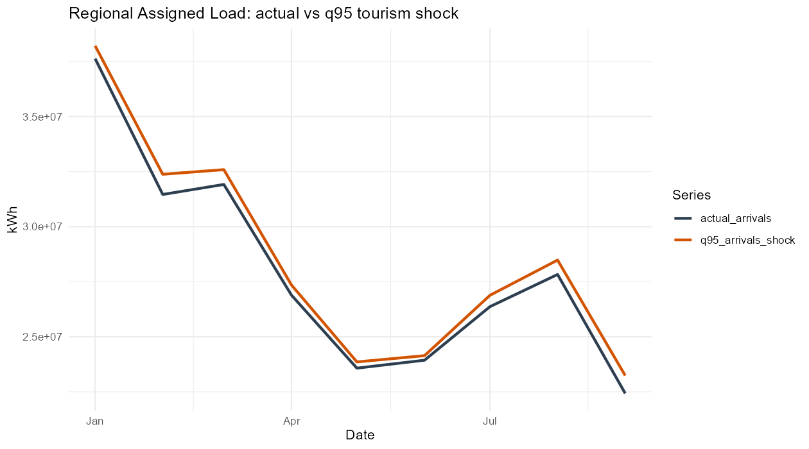
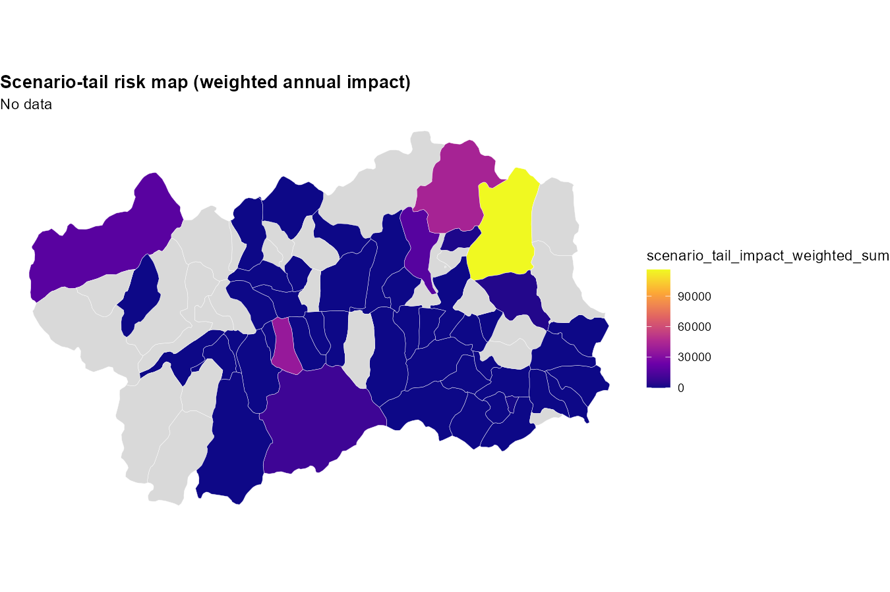
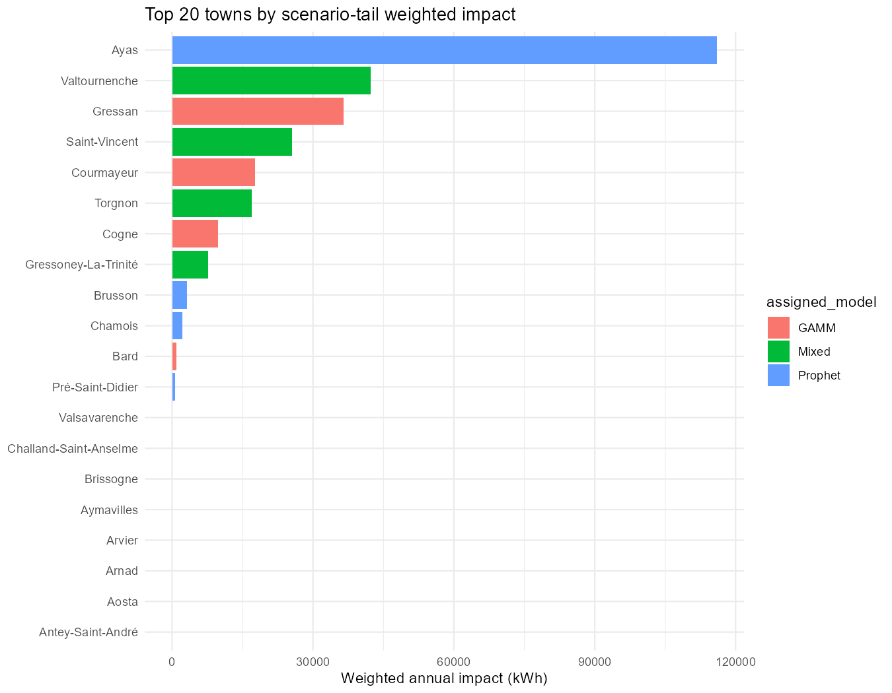
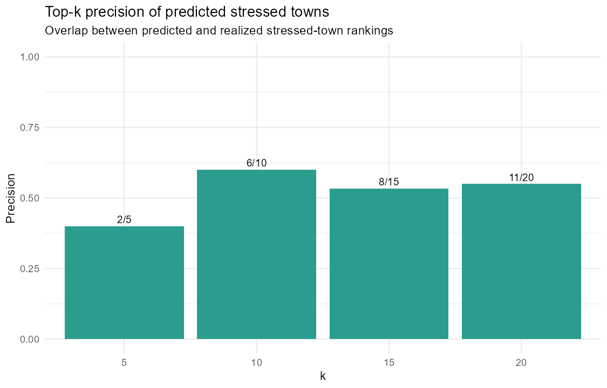

# Executive Summary: Tourism Shock, Load Stress, and Tail Risk (Valle d'Aosta)

## Objective
Assess how a high-tourism shock (bootstrap q95 arrivals) translates into electricity-load stress, and prioritize municipalities where that stress is most likely to become tail risk.

## Method in One Line
The workflow combines:
1. Scenario load deltas from assigned forecasting models (Mixed, GAMM, Prophet), and
2. Municipality-level tourism-energy tail dependence from copula analysis,
then produces a risk-weighted scenario impact ranking.

## Main Findings
1. Regional effect is positive in 8 out of 9 months.
2. Largest regional monthly increase is in September: +3.62%.
3. Risk concentration is strong: a small set of municipalities accounts for most weighted scenario-tail impact.
4. Top municipalities by weighted scenario-tail impact: Ayas, Valtournenche, Gressan.

## Validation (Predicted vs Realized 2025 Stress)
1. Spearman correlation (predicted weighted stress vs realized positive stress): 0.315.
2. Spearman correlation (predicted unweighted stress vs realized positive stress): 0.311.
3. Top-10 overlap (predicted vs realized stressed municipalities): 6/10.
4. Average monthly top-10 hit rate: 0.467.
5. Median monthly top-10 hit rate: 0.400.

Interpretation: predictive signal is moderate but useful for prioritization. The framework is suitable for risk ranking and operational targeting, not for exact point prediction of stress magnitude.

## Decision-Relevant Figures

### Regional Baseline vs q95 Shock

The shock impact is seasonal and non-uniform, with late-summer peaks.

### Final Risk Prioritization Map (Weighted Scenario-Tail Impact)

This is the primary map for intervention prioritization because it combines exposure, conditional tail linkage, and vulnerability.

### Top-20 Municipalities by Weighted Scenario-Tail Impact

Use this ranking for tiered policy response (e.g., Tier-1 high-risk municipalities).

### Validation: Top-k Precision

Shows practical overlap quality between predicted and observed stressed municipalities.

## Recommended Operational Use
1. Use weighted scenario-tail impact as the primary prioritization indicator.
2. Track monthly risk windows (not only annual totals), especially high-tourism months.
3. Maintain a two-tier dashboard:
1. Exposure view (shock delta kWh)
2. Tail-risk view (weighted scenario-tail impact)

## Key Output Files
1. results/scenario_tail_impact_by_town_annual.csv
2. results/scenario_tail_impact_regional_2025.csv
3. results/scenario_tail_validation_summary_metrics.csv
4. results/scenario_tail_validation_topk_metrics.csv
