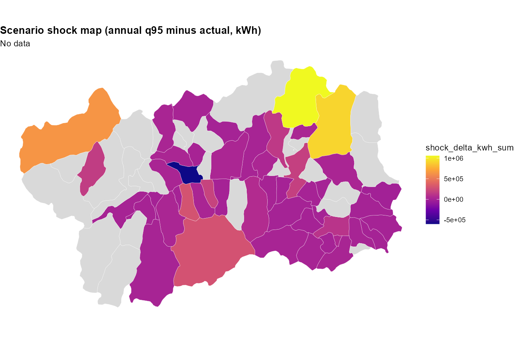
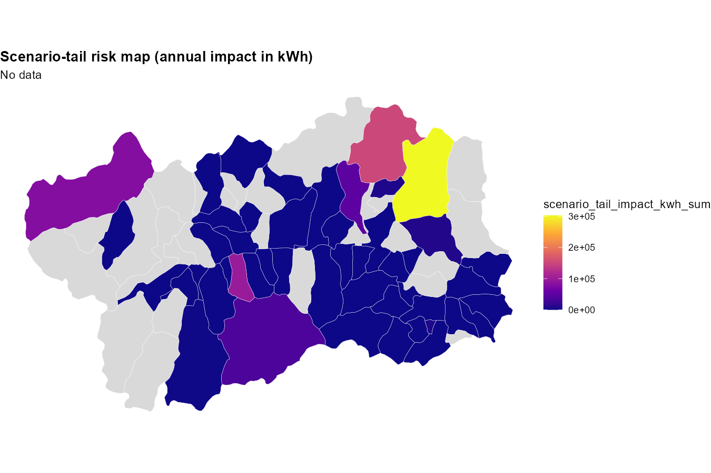
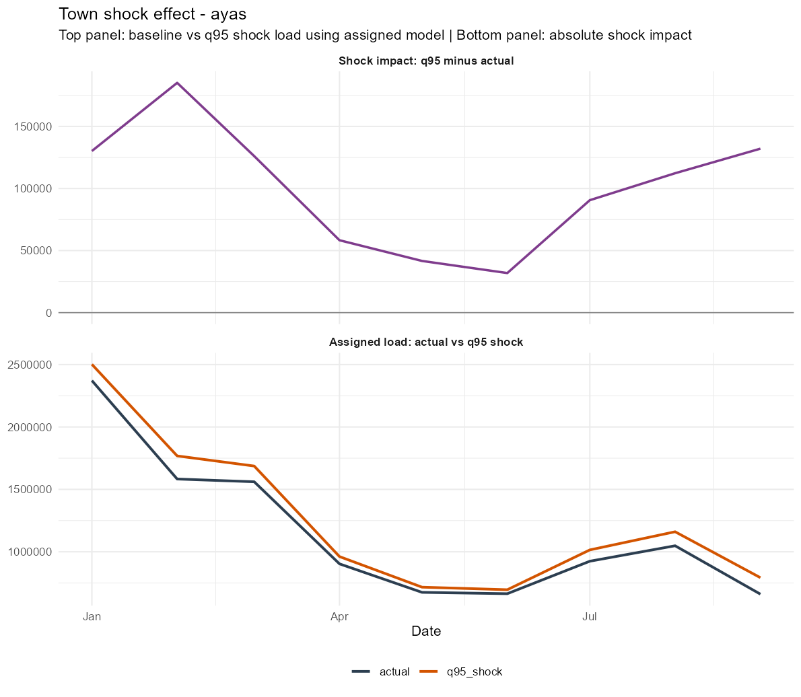
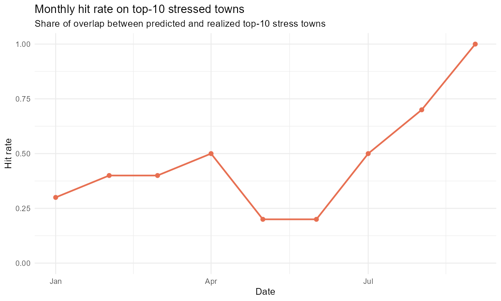
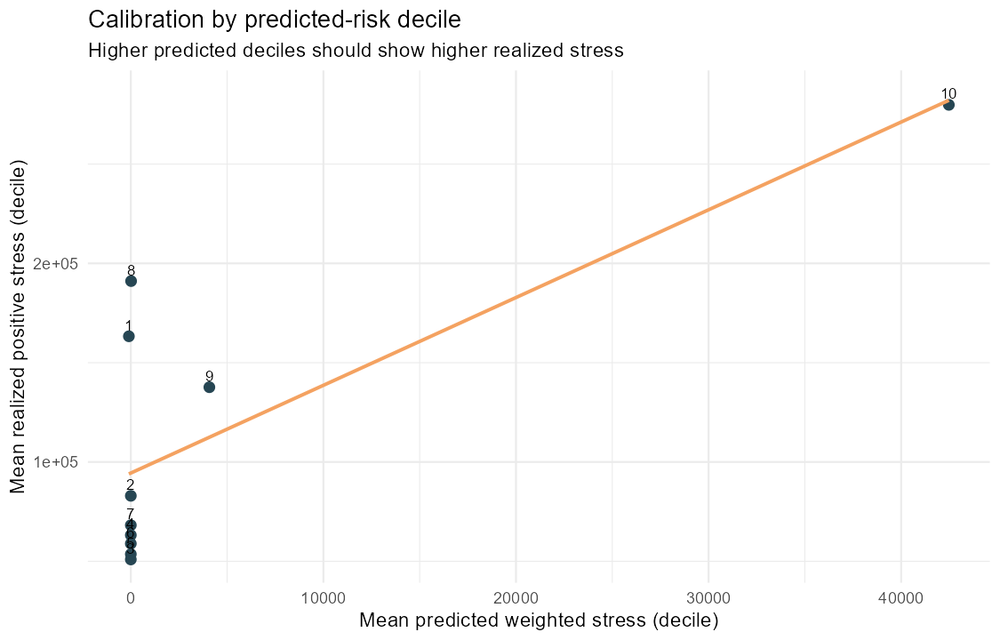

# Scenario Analysis Report: Tourism Shock and Load Tail Risk

## Scope
This report summarizes the scenario workflow where tourism arrivals are shocked using the bootstrap 95th percentile, load is re-estimated with the assigned model per municipality (Mixed, GAMM, Prophet), and then integrated with municipality-level tail-risk dependence from the copula analysis.

Data sources used:
- Forecast scenario outputs in ../Forecast/results/scenario_forecast
- Tail risk outputs in ../Tail Risk/report_assets
- Integrated scenario-tail outputs in ./results

## Key Takeaways
- Regional load shock is positive in 8 out of 9 months, with the largest monthly increase in September (+3.62%).
- Weighted scenario-tail risk is concentrated in a limited set of municipalities; the top contributors are Ayas, Valtournenche, and Gressan.
- Some municipalities show large raw shock deltas but near-zero tail-weighted impact because their conditional tail linkage from tourism to energy is weak.

## Figure 1: Regional Baseline vs q95 Shock (Load)

The regional trajectory shows that the q95 tourism shock generally lifts electricity load relative to the baseline path. The monthly effect is not constant: it ranges from +0.87% (June) to +3.62% (September), indicating seasonal amplification of tourism-driven stress. This confirms that scenario risk is materially time-dependent and should not be represented by a single annual scalar.

## Figure 2: Scenario Shock Map (Annual q95 minus Actual, kWh)

This map isolates pure exposure size: how much annual load changes under q95 arrivals, regardless of tail dependence strength. It highlights where the scenario perturbation is physically large in kWh terms. This is the right figure for infrastructure stress magnitude, but not yet for probability-weighted tail vulnerability.

## Figure 3: Scenario-Tail Impact Map (Annual kWh)

This figure applies conditional tail linkage from Tail Risk (P(Energy tail | Tourism tail, 95%)) to the shock deltas. Compared with Figure 2, some municipalities are down-ranked because their tourism-energy tail transmission is weak. The map therefore moves from exposure-only to exposure-times-dependence risk.

## Figure 4: Weighted Scenario-Tail Risk Map (Final Risk Prioritization)

This is the final prioritization layer: annual scenario-tail impact additionally weighted by municipality risk score from the copula module. It is the most decision-ready map for targeting mitigation and monitoring, because it combines shock magnitude, conditional tail transmission, and persistent vulnerability.

## Figure 5: Top 20 Municipalities by Weighted Scenario-Tail Impact

The ranking confirms concentration of risk in a few municipalities. The leading municipality is Ayas, followed by Valtournenche and Gressan. This ranking is suitable for operational priority lists, contingency planning, and policy sequencing (e.g., tier-1, tier-2 response groups).

## Figure 6: Example Municipality Shock Dynamics (Ayas)

The municipality profile shows two essential effects: (1) separation between actual-based and q95-shock load trajectories, and (2) time-varying absolute delta panel. This confirms that even high-risk municipalities do not experience constant shock pressure through time; stress windows cluster in specific months.

## Interpretation for Tail Risk Usage
The copula analysis in Tail Risk is being used meaningfully in this scenario framework, but as a dependence-weighting layer rather than as a standalone forecast. This is the correct role:
- Forecast module estimates shock magnitude under q95 arrivals.
- Tail Risk module estimates likelihood of joint/tail transmission.
- Scenarios module combines the two into scenario-tail impact metrics and maps.

## Output References
- Integrated monthly table: ./results/scenario_tail_impact_by_town_month.csv
- Integrated annual table: ./results/scenario_tail_impact_by_town_annual.csv
- Regional summary: ./results/scenario_tail_impact_regional_2025.csv
- Top 20 ranking table: ./results/scenario_tail_top20_weighted.csv

## Validation: How Much Predicted Stress Actually Occurred?

We validated scenario-tail predictions against realized 2025 positive stress, defined at town-month level as max(actual_kwh - load_actual_assigned, 0). The validation checks whether municipalities predicted as high stress were also the ones with larger realized stress residuals.

### Figure 7: Top-k Precision of Predicted Stressed Towns

This figure compares ranking overlap between predicted stressed towns and realized stressed towns. Results are meaningful: top-10 overlap is 6/10 (precision 0.60), top-20 overlap is 11/20 (precision 0.55). This indicates the model captures a substantial part of the stress concentration pattern, though not perfectly.

### Figure 8: Monthly Hit Rate on Top-10 Stressed Towns

The monthly hit-rate trajectory shows time-varying predictive skill. Average hit rate is 0.467 and median is 0.40, meaning that in a typical month around 4 to 5 towns out of 10 overlap between predicted and realized stress rankings. Skill is present but seasonal and not constant across months.

### Figure 9: Calibration by Predicted-Risk Decile

Deciles with higher predicted weighted stress tend to show higher realized positive stress, confirming directional calibration. The association is moderate (Spearman 0.315, Pearson 0.285), which supports using the scenario-tail metric for prioritization and relative ranking rather than point-accurate absolute prediction.

### Validation Metrics (Summary)
- Spearman(predicted weighted stress, realized positive stress): 0.315
- Spearman(predicted unweighted stress, realized positive stress): 0.311
- Pearson(predicted weighted stress, realized positive stress): 0.285
- Average monthly hit rate (top-10): 0.467
- Median monthly hit rate (top-10): 0.400

### Validation Output Files
- ./results/scenario_tail_validation_summary_metrics.csv
- ./results/scenario_tail_validation_topk_metrics.csv
- ./results/scenario_tail_validation_monthly_hit_rate.csv
- ./results/scenario_tail_validation_calibration_deciles.csv
- ./results/scenario_tail_validation_join_annual.csv
