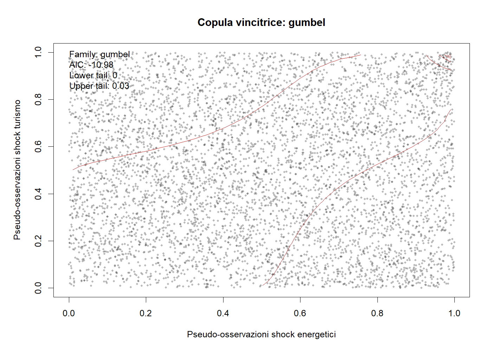
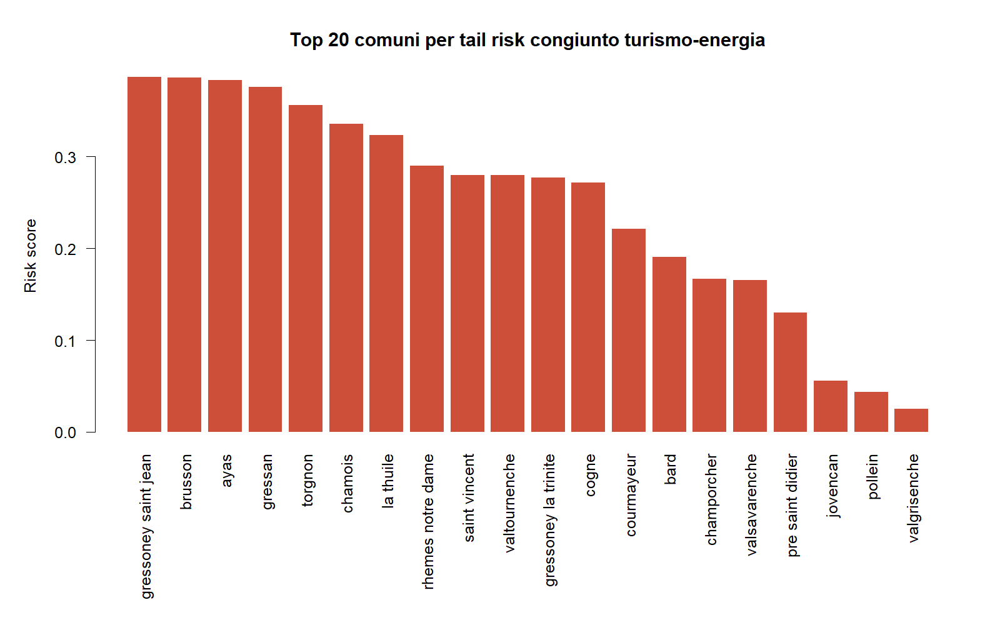
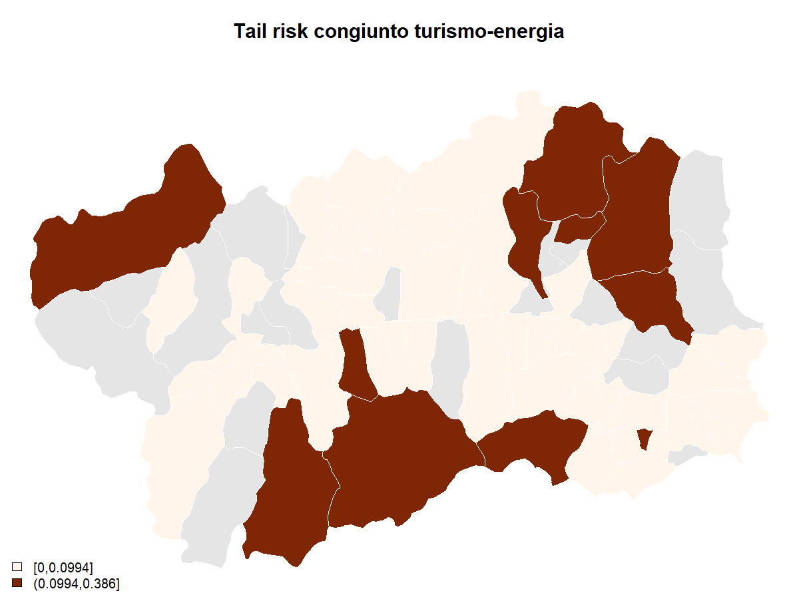
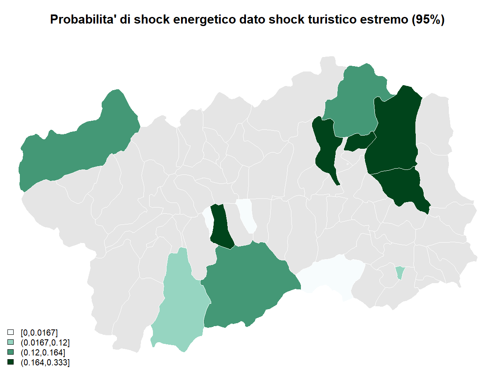
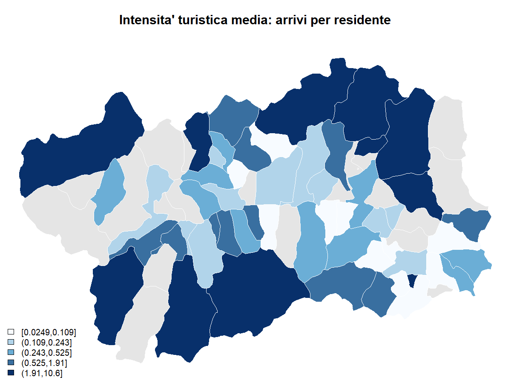
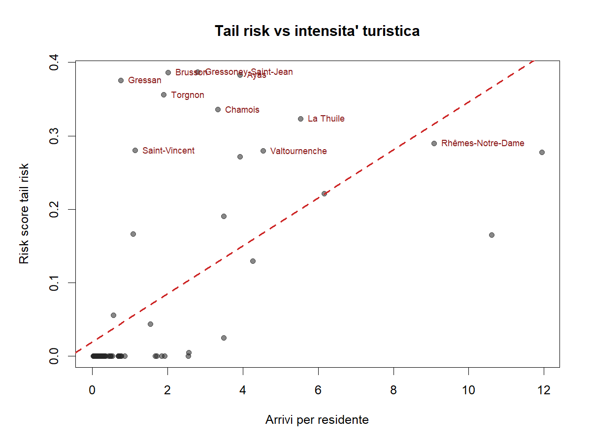

# Tail Risk Report

## Sintesi

La copula pooled vincente e' **gumbel**, con tail dependence superiore pari a **0.030** e tail inferiore nulla.
 Nei comuni ad alto tail risk la dipendenza di coda alta sale a **0.087**, mentre nei comuni a piu' alta intensita' turistica sale a **0.065**.
 La correlazione tra risk score e arrivi per residente e' **0.613**; l'overlap tra top 10 rischio e top 10 intensita' turistica e' **4 comuni** (quota **0.40**).

## Copule

### Tabella riassuntiva per segmento

| Segmento | Osservazioni | Copula vincente | LogLik | AIC | BIC | Tail bassa | Tail alta |
| --- | --- | --- | --- | --- | --- | --- | --- |
| all_comuni | 5892 | gumbel | 6.491 | -10.983 | -4.301 | 0.000 | 0.030 |
| top10_tail_risk |  804 | gumbel | 14.855 | -27.711 | -23.021 | 0.000 | 0.087 |
| top10_tourism_intensity |  804 | gumbel | 13.231 | -24.461 | -19.771 | 0.000 | 0.065 |

### Famiglie testate sul campione pooled

| Famiglia | LogLik | AIC | BIC | Tail bassa | Tail alta |
| --- | --- | --- | --- | --- | --- |
| gumbel | 6.491 | -10.983 | -4.301 | 0.000 | 0.030 |
| student_t | 5.045 | -6.090 | 7.273 | 0.000 | 0.000 |
| clayton | 2.890 | -3.779 | 2.902 | 0.000 | 0.000 |
| frank | 0.267 | 1.466 | 8.148 | 0.000 | 0.000 |
| gaussian | 0.038 | 1.923 | 8.605 | 0.000 | 0.000 |

### Parametro della copula pooled vincente

Famiglia: **gumbel**; parametro: **1.022**; standard error: **0.007**; tail alta: **0.030**.

## Localizzazione del tail risk

### Top 15 comuni per rischio congiunto turismo-energia

| Rank | Comune | Risk score | P(Energy|Tourism 95%) | Joint 95 | P(Energy|Tourism 90%) | Arrivi/residente | Rank turismo |
| --- | --- | --- | --- | --- | --- | --- | --- |
|  1 | Gressoney-Saint-Jean | 0.387 | 0.333 | 1 | 0.286 | 2.80 | 13 |
|  2 | Brusson | 0.386 | 0.333 | 1 | 0.286 | 2.02 | 16 |
|  3 | Ayas | 0.383 | 0.333 | 2 | 0.273 | 3.93 |  8 |
|  4 | Gressan | 0.376 | 0.333 | 1 | 0.250 | 0.76 | 28 |
|  5 | Torgnon | 0.356 | 0.333 | 1 | 0.167 | 1.90 | 18 |
|  6 | Chamois | 0.336 | 0.250 | 1 | 0.300 | 3.33 | 12 |
|  7 | La Thuile | 0.323 | 0.222 | 4 | 0.324 | 5.53 |  5 |
|  8 | Rhêmes-Notre-Dame | 0.290 | 0.154 | 4 | 0.368 | 9.08 |  3 |
|  9 | Saint-Vincent | 0.280 | 0.200 | 2 | 0.211 | 1.13 | 23 |
| 10 | Valtournenche | 0.280 | 0.143 | 2 | 0.355 | 4.54 |  6 |
| 11 | Gressoney-La-Trinité | 0.277 | 0.185 | 5 | 0.238 | 11.94 |  1 |
| 12 | Cogne | 0.271 | 0.125 | 1 | 0.364 | 3.92 |  9 |
| 13 | Courmayeur | 0.221 | 0.125 | 2 | 0.171 | 6.16 |  4 |
| 14 | Bard | 0.191 | 0.100 | 5 | 0.113 | 3.50 | 10 |
| 15 | Champorcher | 0.167 | 0.000 | 0 | 0.667 | 1.08 | 24 |

### Mappe

## Rischio vs intensita' turistica

### Comuni che compaiono in alto per rischio e/o intensita' turistica

| Comune | Rank rischio | Rank turismo | Risk score | Arrivi/residente |
| --- | --- | --- | --- | --- |
| Gressoney-Saint-Jean |  1 | 13 | 0.387 | 2.80 |
| Brusson |  2 | 16 | 0.386 | 2.02 |
| Ayas |  3 |  8 | 0.383 | 3.93 |
| Gressan |  4 | 28 | 0.376 | 0.76 |
| Torgnon |  5 | 18 | 0.356 | 1.90 |
| Chamois |  6 | 12 | 0.336 | 3.33 |
| La Thuile |  7 |  5 | 0.323 | 5.53 |
| Rhêmes-Notre-Dame |  8 |  3 | 0.290 | 9.08 |
| Saint-Vincent |  9 | 23 | 0.280 | 1.13 |
| Valtournenche | 10 |  6 | 0.280 | 4.54 |
| Gressoney-La-Trinité | 11 |  1 | 0.277 | 11.94 |
| Cogne | 12 |  9 | 0.271 | 3.92 |
| Courmayeur | 13 |  4 | 0.221 | 6.16 |
| Bard | 14 | 10 | 0.191 | 3.50 |
| Valsavarenche | 16 |  2 | 0.165 | 10.61 |
| Pré-Saint-Didier | 17 |  7 | 0.130 | 4.27 |

## Lettura operativa

- Il tail risk non e' diffuso in modo uniforme: si concentra in un gruppo ristretto di comuni alpini e turistici.
- La copula sui top 10 comuni risk-ranked mostra una tail dependence superiore piu' forte del campione pooled, quindi l'aggregazione regionale attenua il segnale.
- L'intensita' turistica media spiega parte del ranking, ma non tutto: alcuni comuni emergono come vulnerabili pur non essendo ai primissimi posti per arrivi per residente.
- Per il paper, la domanda forte diventa: dove gli shock turistici estremi si trasmettono piu' facilmente in shock energetici estremi?
