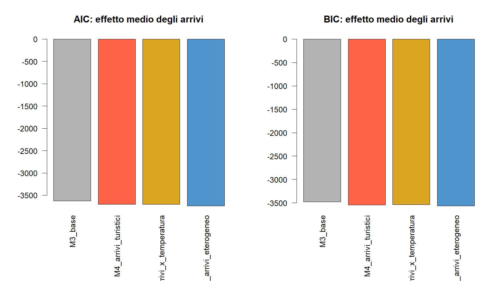
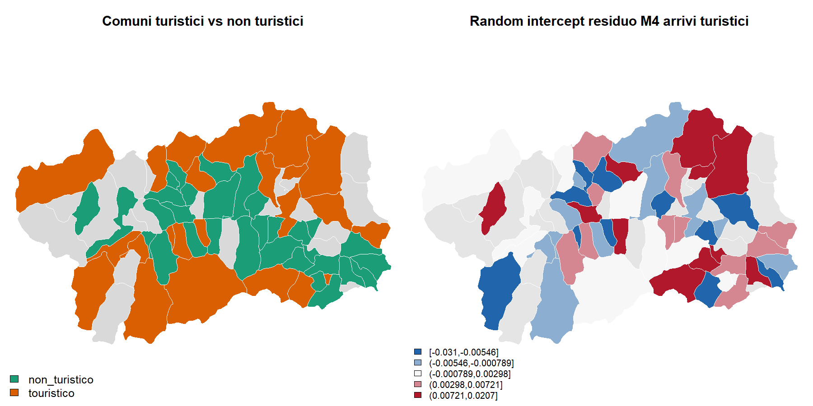
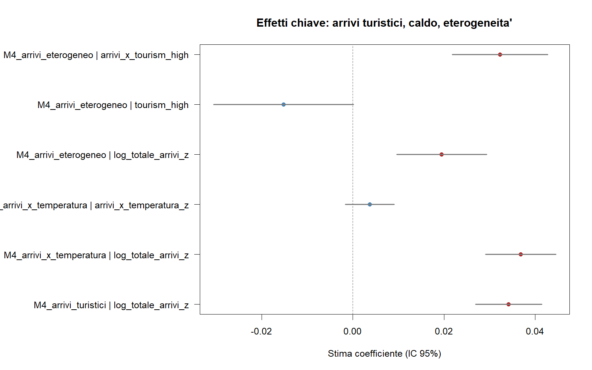

# Mean Effect: arrivi turistici e consumo energetico

## Introduzione

Questa cartella raccoglie il blocco di analisi sull'effetto medio nel percorso:

[Introduzione] -> [Modelli M1-M4] -> [Copule (Residui)] -> [Forecasting]

Qui l'obiettivo e' capire se gli arrivi turistici aumentano il consumo energetico medio, se l'effetto cresce nei mesi piu' caldi e se cambia tra comuni turistici e non turistici.

## Modelli M1-M4

La sequenza base resta quella dei modelli M0-M4, ma il blocco finale non usa piu' un generico 'turismo': usa solo gli arrivi turistici.

| Modello | AIC | BIC | R2 marginale | R2 condizionale | Singolare |
|---|---:|---:|---:|---:|---|
| M3_base | -3629.8 | -3476.1 | 0.9821 | NA | TRUE |
| M4_arrivi_turistici | -3703.2 | -3542.8 | 0.9823 | 0.9824 | FALSE |
| M4_arrivi_x_temperatura | -3702.9 | -3535.8 | 0.9822 | 0.9824 | FALSE |
| M4_arrivi_eterogeneo | -3741.8 | -3568.1 | 0.9824 | 0.9825 | FALSE |

## Interazione arrivi x temperatura

Nel modello con interazione, il coefficiente base degli arrivi turistici resta positivo, mentre l'interazione `arrivi x temperatura` e' stimata a 0.0037 con p-value 0.1736.

Interpretazione:
- non emerge una evidenza robusta che l'effetto degli arrivi turistici cambi con la temperatura;
- questo test serve a distinguere l'effetto dei flussi turistici da un semplice effetto clima/condizionamento.

## Effetto eterogeneo: comuni turistici vs non turistici

I comuni sono classificati usando il valore mediano degli arrivi per residente nel periodo post-2018. La soglia mediana e' 0.473, con 36 comuni turistici e 37 non turistici.

Nel modello eterogeneo, la differenza di pendenza tra comuni turistici e non turistici e' 0.0323 con p-value 5.198e-09.
L'effetto degli arrivi turistici e' 0.0195 nei comuni non turistici e 0.0517 nei comuni turistici.

Questo indica che l'impatto marginale degli arrivi turistici e' piu' forte nei comuni gia' piu' esposti al turismo.

## Lettura territoriale

I comuni con maggiore intensita' turistica secondo gli arrivi per residente sono:
- Gressoney-La-Trinité: 11.94
- Valsavarenche: 10.61
- Rhêmes-Notre-Dame: 9.08
- Courmayeur: 6.16
- La Thuile: 5.53
- Valtournenche: 4.54
- Pré-Saint-Didier: 4.27
- Ayas: 3.93
- Cogne: 3.92
- Bard: 3.50

La mappa a sinistra separa i comuni turistici da quelli non turistici; la mappa a destra mostra il random intercept residuo del modello M4 con arrivi turistici. Se in alcune aree turistiche il random intercept resta alto, significa che c'e' ancora eterogeneita' locale non catturata dai regressori medi del modello.

## Coefficienti chiave

- Effetto medio degli arrivi turistici in M4: 0.0342, p-value 1.124e-17.
- Interazione arrivi x temperatura: 0.0037, p-value 0.1736.
- Extra-effetto dei comuni turistici: 0.0323, p-value 5.198e-09.

## Sintesi

- Nel blocco M4 la nomenclatura corretta e' 'arrivi turistici', non turismo generico.
- L'interazione con la temperatura non aggiunge evidenza robusta: gli arrivi contano, ma non soprattutto perche' coincidono coi mesi piu' caldi.
- L'effetto medio degli arrivi non e' uniforme nello spazio: cambia tra comuni turistici e non turistici.
- Questa cartella copre l'effetto medio; le code dei residui e la pianificazione previsiva sono separate nelle cartelle Tail Risk e Forecast.
