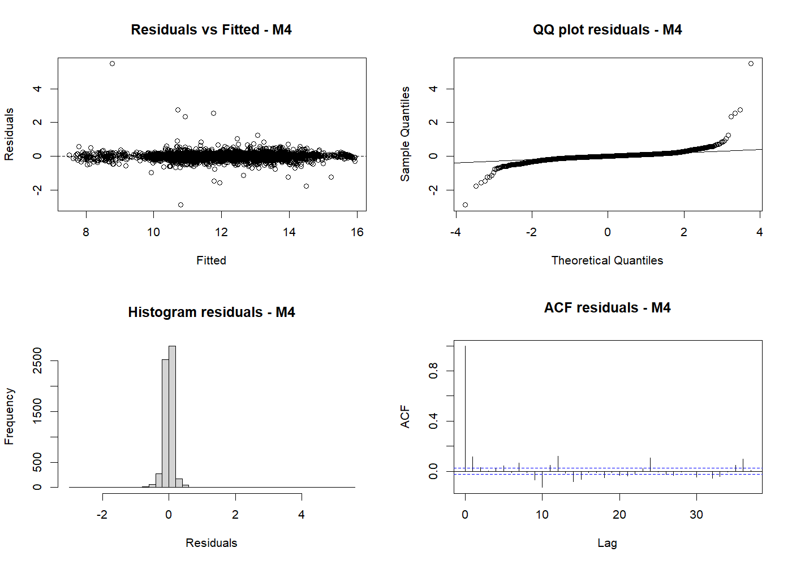

# Lettura statistica dei modelli M0-M4

## Obiettivo del report

Questo documento serve come base per un report PDF. Riassume in modo strutturato:

- l'interpretazione statistica dei modelli M0-M4;
- i principali coefficienti stimati, modello per modello;
- i problemi potenziali di ciascuna specificazione;
- il confronto numerico finale tra i modelli;
- i grafici principali utili per la discussione.

## Setup del modello

Il modello stima il consumo energetico comunale con risposta:

$$
\log(\mathrm{kwh} + 1)
$$

con random intercept per comune. Quasi tutti i predittori numerici sono standardizzati, quindi i coefficienti dei regressori continui vanno letti come variazione attesa del log-consumo a fronte di un aumento di una deviazione standard del predittore, a parita' delle altre variabili.

I coefficienti dei fattori `year_factor` sono invece differenze rispetto all'anno di riferimento, che in pratica e' il 2018.

## Qualita' del dato e campione effettivo

| Metrica | Valore |
|---|---:|
| Osservazioni grezze nel CSV | 9546 |
| Osservazioni dopo filtro `year >= 2018` | 6882 |
| Osservazioni nel campione finale comune a tutti i modelli | 5973 |
| Valori `kwh` negativi | 8 |
| Valori `kwh` mancanti | 0 |

Osservazioni:

- Il campione analitico finale usa 5973 righe, quindi c'e' una perdita non trascurabile rispetto al dataset originario, dovuta a lag, complete cases e costruzione delle variabili.
- Ci sono 8 valori negativi di `kwh`, che spiegano i warning di `log1p()` e segnalano un problema da discutere nel report: un consumo negativo e' in generale poco plausibile e merita verifica o trattamento dedicato.

## M0 - Baseline

### Specificazione

$$
\log(\mathrm{kwh}_{it}+1) = \beta_0 + u_i + \varepsilon_{it}
$$

### Coefficienti

| Termine | Stima | Std. Error | p-value |
|---|---:|---:|---:|
| Intercetta | 11.9862 | 0.1494 | 1.08e-73 |

### Lettura statistica

M0 e' un benchmark puro. Non spiega la variabilita' temporale del consumo, ma misura quanta eterogeneita' strutturale esiste tra comuni attraverso il random intercept.

Il fatto che il modello abbia gia' un $R^2$ condizionale molto alto ($0.951$) indica che una quota enorme della variabilita' totale e' legata a differenze persistenti tra comuni, cioe' livelli medi sistematicamente diversi di consumo.

### Problemi potenziali

- Non c'e' alcuna spiegazione causale o descrittiva della dinamica temporale: il modello serve solo come riferimento.
- Il valore dell'intercetta, da solo, e' poco informativo sul piano sostantivo.
- Un $R^2$ condizionale gia' altissimo qui suggerisce che il panel e' molto eterogeneo tra comuni, ma non dice ancora nulla sulla capacita' dei covariati di spiegare le variazioni nel tempo.

## M1 - Blocco meteo

### Coefficienti del blocco meteo

| Termine | Stima | Std. Error | p-value | Lettura |
|---|---:|---:|---:|---|
| `temperatura_z` | -0.1054 | 0.0042 | 4.21e-131 | Effetto negativo forte: a temperatura piu' alta il consumo tende a ridursi. |
| `log_precipitazione_z` | -0.0230 | 0.0040 | 6.13e-09 | Pioggia associata a un lieve calo del consumo. |
| `pressione_z` | 0.0162 | 0.0075 | 0.0313 | Effetto positivo debole ma statisticamente significativo. |
| `umidit_relativa_z` | -0.0081 | 0.0041 | 0.0491 | Effetto negativo molto piccolo e borderline. |

### Lettura statistica

M1 migliora nettamente rispetto a M0: l'AIC scende da 2777.5 a 1976.9 e il test di confronto M0 vs M1 e' fortemente significativo ($\chi^2 = 808.7$, 4 gdl, $p \approx 1.0 \times 10^{-173}$).

Dal punto di vista econometrico, il meteo aggiunge informazione, ma il contributo marginale resta modesto in termini di $R^2$ marginale: si passa solo da 0 a 0.0067. Questo significa che il meteo da solo spiega una parte reale ma ancora piccola della variabilita' intra-comune.

### Problemi potenziali

- I segni meteo non sono ancora stabili: temperatura e precipitazione risultano negative, ma piu' avanti alcuni segni cambiano quando entrano stagionalita' e dinamica. Questo e' un indizio di confondimento con la struttura temporale.
- Il blocco meteo qui rischia di assorbire effetti stagionali non ancora modellati in modo esplicito.
- L'umidita' e' solo borderline significativa, quindi non va sovrainterpretata.

## M2 - Blocco calendario e stagionalita'

### Coefficienti meteo e stagionalita'

| Termine | Stima | Std. Error | p-value | Lettura |
|---|---:|---:|---:|---|
| `temperatura_z` | 0.0833 | 0.0164 | 4.17e-07 | Il segno si ribalta: una volta controllata la stagionalita', temperature piu' alte sono associate a piu' consumo. |
| `log_precipitazione_z` | 0.0139 | 0.0045 | 0.0020 | Effetto positivo lieve ma significativo. |
| `pressione_z` | 0.0088 | 0.0072 | 0.2246 | Non significativo. |
| `umidit_relativa_z` | -0.0024 | 0.0046 | 0.6019 | Non significativo. |
| `sin_m1_z` | 0.0842 | 0.0101 | 6.48e-17 | Forte componente stagionale annuale. |
| `cos_m1_z` | 0.1829 | 0.0122 | 9.21e-50 | Componente stagionale molto forte. |
| `sin_m2_z` | 0.0601 | 0.0040 | 1.45e-49 | Armonica semi-annuale rilevante. |
| `cos_m2_z` | 0.0381 | 0.0032 | 2.96e-32 | Armonica significativa. |
| `sin_m3_z` | -0.0253 | 0.0032 | 1.65e-15 | Stagionalita' di ordine superiore significativa. |
| `cos_m3_z` | 0.0477 | 0.0033 | 7.63e-47 | Stagionalita' di ordine superiore significativa. |

### Effetti anno

| Termine | Stima | p-value | Lettura |
|---|---:|---:|---|
| `year_factor2020` | -0.0408 | 0.00047 | 2020 sotto il 2018. |
| `year_factor2021` | -0.0310 | 0.0091 | 2021 sotto il 2018. |
| `year_factor2022` | -0.0014 | 0.9095 | Nessuna differenza rispetto al 2018. |
| `year_factor2023` | 0.0169 | 0.1527 | Non significativo. |
| `year_factor2024` | 0.0779 | 9.74e-11 | 2024 sopra il 2018. |
| `year_factor2025` | 0.0147 | 0.2589 | Non significativo. |

### Lettura statistica

M2 e' il primo vero salto di qualita'. L'AIC scende a 612.8 e il confronto M1 vs M2 e' fortemente significativo ($\chi^2 = 1388.0$, 12 gdl, $p \approx 5.25 \times 10^{-290}$). Il $R^2$ marginale sale a 0.0159.

La conclusione sostantiva e' che la struttura temporale regolare conta molto piu' del solo meteo. I termini Fourier mostrano un pattern stagionale estremamente forte. Inoltre, il fatto che temperatura e precipitazione cambino segno rispetto a M1 indica che in M1 stavano in parte catturando stagionalita' non modellata.

### Problemi potenziali

- I termini Fourier sono efficaci, ma meno interpretabili di variabili calendario semplici come weekend, festivo e mese.
- Il ribaltamento di segno dei coefficienti meteo tra M1 e M2 segnala instabilita' strutturale delle stime quando il modello e' incompleto.
- Il blocco anno puo' catturare shock aggregati, ma non spiega il meccanismo sottostante.

## M3 - Blocco dinamica temporale

### Coefficienti principali

| Termine | Stima | Std. Error | p-value | Lettura |
|---|---:|---:|---:|---|
| `temperatura_z` | 0.0101 | 0.0071 | 0.1576 | Non significativo dopo aver introdotto i lag. |
| `log_precipitazione_z` | 0.0119 | 0.0032 | 0.00020 | Effetto positivo piccolo ma robusto. |
| `pressione_z` | 0.0061 | 0.0031 | 0.0501 | Borderline. |
| `umidit_relativa_z` | -0.0062 | 0.0030 | 0.0396 | Effetto negativo piccolo ma significativo. |
| `log_kwh_lag1_z` | 0.8167 | 0.0122 | < 1e-16 | Persistenza fortissima a breve periodo. |
| `log_kwh_lag12_z` | 0.4901 | 0.0122 | 6.31e-312 | Persistenza stagionale molto forte. |

### Stagionalita' e anni rilevanti

| Termine | Stima | p-value |
|---|---:|---:|
| `sin_m1_z` | -0.0227 | 1.14e-07 |
| `cos_m1_z` | 0.0322 | 4.46e-09 |
| `sin_m2_z` | 0.0104 | 0.00012 |
| `cos_m2_z` | 0.0503 | 6.58e-93 |
| `sin_m3_z` | -0.0452 | 1.46e-77 |
| `cos_m3_z` | 0.0138 | 5.00e-09 |
| `year_factor2020` | -0.0274 | 0.00131 |
| `year_factor2024` | 0.0171 | 0.0495 |
| `year_factor2025` | -0.0699 | 1.23e-13 |

### Lettura statistica

M3 e' il modello che cambia radicalmente la qualita' del fit. L'AIC crolla da 612.8 a -3717.7, con un test di confronto M2 vs M3 enorme ($\chi^2 = 4334.5$, 2 gdl, $p \approx 0$). Il $R^2$ marginale sale a 0.982.

L'interpretazione e' chiara: il consumo ha una fortissima inerzia temporale. Il livello del mese precedente e quello a 12 mesi sono i driver dominanti. In pratica, una volta inserita la dinamica, una grossa parte della variabilita' temporale viene spiegata dalla persistenza stessa del processo di consumo.

Questo e' coerente con molti contesti energetici: il consumo corrente e' fortemente legato sia alla storia recente sia alla stagionalita' dello stesso mese dell'anno precedente.

### Problemi potenziali

- `M3` risulta singolare. Questo e' un segnale importante: il random intercept per comune collassa o diventa quasi ridondante una volta inseriti i lag. Di conseguenza il $R^2$ condizionale non e' stimato in modo affidabile e resta `NA`.
- C'e' il rischio di un modello troppo dominato dall'autoregressione: ottimo per spiegare il consumo, meno utile se l'obiettivo e' isolare gli effetti strutturali dei blocchi esogeni.
- Alcuni effetti meteo perdono significativita', segno che una parte della loro informazione era gia' contenuta nella dinamica del consumo.

## M4 - Blocco turismo

### Coefficienti principali

| Termine | Stima | Std. Error | p-value | Lettura |
|---|---:|---:|---:|---|
| `temperatura_z` | 0.0221 | 0.0077 | 0.0041 | Effetto positivo, piccolo ma significativo. |
| `log_precipitazione_z` | 0.0104 | 0.0032 | 0.0011 | Effetto positivo modesto. |
| `pressione_z` | 0.0046 | 0.0033 | 0.1685 | Non significativo. |
| `umidit_relativa_z` | -0.0050 | 0.0031 | 0.1047 | Non significativo. |
| `log_kwh_lag1_z` | 0.8001 | 0.0123 | < 1e-16 | Persistenza di breve periodo ancora dominante. |
| `log_kwh_lag12_z` | 0.4876 | 0.0122 | 4.20e-309 | Persistenza stagionale ancora dominante. |
| `log_totale_presenze_z` | -0.0069 | 0.0120 | 0.5681 | Non significativo. |
| `log_totale_arrivi_z` | 0.0386 | 0.0120 | 0.0013 | Effetto turistico positivo e significativo. |

### Stagionalita' e anni rilevanti

| Termine | Stima | p-value |
|---|---:|---:|
| `sin_m1_z` | -0.0095 | 0.0454 |
| `cos_m1_z` | 0.0442 | 2.62e-13 |
| `sin_m2_z` | 0.0006 | 0.8532 |
| `cos_m2_z` | 0.0507 | 1.75e-95 |
| `sin_m3_z` | -0.0436 | 3.55e-73 |
| `cos_m3_z` | 0.0149 | 3.62e-10 |
| `year_factor2021` | 0.0190 | 0.0280 |
| `year_factor2025` | -0.0731 | 7.72e-15 |

### Lettura statistica

M4 migliora in modo chiaro rispetto a M3. L'AIC passa da -3717.7 a -3786.0 e il confronto M3 vs M4 e' altamente significativo ($\chi^2 = 72.24$, 2 gdl, $p \approx 2.06 \times 10^{-16}$).

Il risultato sostantivo centrale e' questo:

- le `presenze` non aggiungono evidenza statistica autonoma una volta controllati dinamica, meteo e stagionalita';
- gli `arrivi` invece hanno un coefficiente positivo e statisticamente significativo.

Quindi il turismo sembra contribuire al consumo energetico soprattutto tramite la componente di flusso in ingresso, piu' che tramite la permanenza aggregata misurata dalle presenze.

Il modello M4 inoltre non e' singolare, quindi e' piu' stabile di M3 dal punto di vista della struttura mista.

### Problemi potenziali

- `presenze` e `arrivi` sono plausibilmente collineari tra loro e anche con la stagionalita', quindi l'interpretazione del coefficiente turistico va fatta con cautela.
- Il coefficiente di `arrivi` e' significativo ma molto piu' piccolo dei coefficienti dei lag: il turismo migliora il modello, ma non ne diventa il driver dominante.
- Il blocco turismo agisce su un modello gia' quasi saturo dal punto di vista predittivo; quindi il suo contributo e' incrementale, non strutturalmente rivoluzionario.

## Confronto numerico M0-M4

### Tabella di confronto complessiva

| Modello | nobs | AIC | BIC | logLik | R2 marginale | R2 condizionale | Singolare |
|---|---:|---:|---:|---:|---:|---:|---|
| M0_baseline | 5973 | 2777.54 | 2797.63 | -1385.77 | 0.0000 | 0.9510 | FALSE |
| M1_meteo | 5973 | 1976.86 | 2023.73 | -981.43 | 0.0067 | 0.9574 | FALSE |
| M2_calendario | 5973 | 612.82 | 740.02 | -287.41 | 0.0159 | 0.9661 | FALSE |
| M3_dinamica | 5973 | -3717.73 | -3577.13 | 1879.86 | 0.9820 | NA | TRUE |
| M4_turismo | 5973 | -3785.96 | -3631.98 | 1915.98 | 0.9821 | 0.9822 | FALSE |

### Lettura della tabella

- M1 migliora M0, ma il guadagno resta relativamente contenuto in termini di varianza spiegata dai fixed effects.
- M2 migliora molto M1, mostrando che la struttura calendario/stagionale conta piu' del solo meteo.
- M3 e' il salto decisivo: la dinamica temporale spiega quasi tutta la variabilita' residua.
- M4 migliora ancora M3 in modo statisticamente robusto, quindi il turismo aggiunge informazione reale, ma su scala piu' contenuta rispetto alla dinamica.

### Test di confronto annidato

| Confronto | Chisq | gdl | p-value | Lettura |
|---|---:|---:|---:|---|
| M0 -> M1 | 808.68 | 4 | 1.01e-173 | Il meteo migliora nettamente la baseline. |
| M1 -> M2 | 1388.05 | 12 | 5.25e-290 | Calendario e stagionalita' migliorano molto il modello. |
| M2 -> M3 | 4334.54 | 2 | ~0 | La dinamica temporale e' il blocco piu' importante. |
| M3 -> M4 | 72.24 | 2 | 2.06e-16 | Il turismo aggiunge capacita' esplicativa incrementale. |

## Focus sulle varianti del turismo

### Confronto numerico

| Modello | AIC | BIC | Chisq vs precedente | gdl | p-value |
|---|---:|---:|---:|---:|---:|
| m3 | -3717.73 | -3577.13 | NA | NA | NA |
| m4_arrivi | -3787.64 | -3640.35 | 71.91 | 1 | 2.25e-17 |
| m4_presenze | -3777.75 | -3630.46 | 0.00 | 0 | NA |
| m4_both | -3785.96 | -3631.98 | 10.21 | 1 | 0.00140 |

### Lettura

Il miglior modello turistico secondo AIC e BIC e' `m4_arrivi`. Questo rafforza l'idea che il segnale turistico piu' informativo sia il flusso di arrivi, non il volume di presenze.

L'aggiunta delle `presenze` oltre agli `arrivi` non migliora il modello quanto ci si potrebbe aspettare e suggerisce ridondanza informativa.

## Diagnostica del modello finale M4

La diagnostica grafica del modello finale mostra un quadro complessivamente buono, ma non perfetto.

- Il grafico Residuals vs Fitted non mostra una struttura macroscopica fortemente distorta, quindi la specificazione e' ragionevole.
- Il QQ plot segnala code pesanti e outlier, specialmente nella coda destra. La normalita' dei residui non e' perfetta.
- L'istogramma mostra una forte concentrazione attorno a zero, coerente con un buon fit medio.
- L'ACF dei residui suggerisce che la dinamica principale e' stata catturata, anche se restano piccole dipendenze residue a specifici lag.

## Sintesi finale per il report

Le risposte alle domande del progetto possono essere riassunte cosi':

1. Il meteo spiega una parte del consumo, ma da solo ha potere esplicativo limitato.
2. Calendario e stagionalita' migliorano molto il modello e cambiano anche l'interpretazione di alcune variabili meteo.
3. La dinamica temporale del consumo e' il blocco nettamente piu' importante in termini di fit.
4. Il turismo aggiunge un contributo incrementale statisticamente significativo, ma concentrato soprattutto nella variabile `arrivi`.
5. Il modello finale migliore, tra quelli provati, e' quello con dinamica + turismo, ma il turismo non sostituisce il ruolo dominante della persistenza del consumo.

## Criticita' da riportare esplicitamente nel PDF

| Tema | Evidenza | Implicazione |
|---|---|---|
| Valori negativi di `kwh` | 8 osservazioni | Possibile problema di qualita' dati o convenzione di segno. |
| Riduzione del campione | 9546 -> 5973 osservazioni | Il fit finale e' stimato su un sottoinsieme non banale del dataset originario. |
| Singolarita' in M3 | `singular = TRUE` | La struttura random e' instabile in M3. |
| Code residue pesanti | QQ plot M4 | Inferenza classica da trattare con cautela. |
| Turismo meno forte della dinamica | Coefficienti e confronto AIC/BIC | Il turismo conta, ma come effetto incrementale. |
| Possibile collinearita' tra covariate | dinamica + turismo + stagionalita' | Interpretazione causale dei coefficienti da fare con prudenza. |

## File di supporto generati

Per il report PDF sono stati generati anche i seguenti asset:

- `report_assets/comparison_table.csv`
- `report_assets/nested_anova.csv`
- `report_assets/tourism_compare.csv`
- `report_assets/fixed_effects_table.csv`
- `report_assets/model_comparison_metrics.png`
- `report_assets/arrivi_model_compare.png`
- `report_assets/final_model_residuals.png`
- `report_assets/coef_m1_meteo.png`
- `report_assets/coef_m2_calendario.png`
- `report_assets/coef_m3_dinamica.png`
- `report_assets/coef_m4_arrivi_turistici.png`
