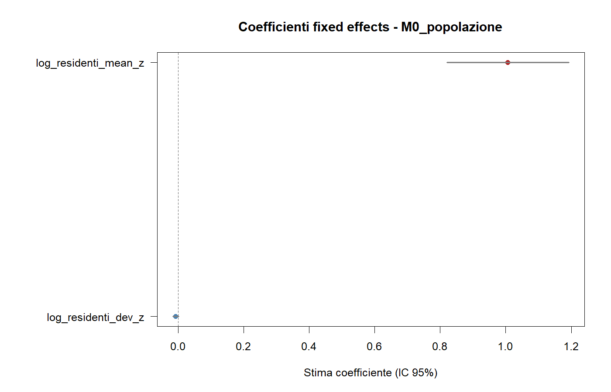
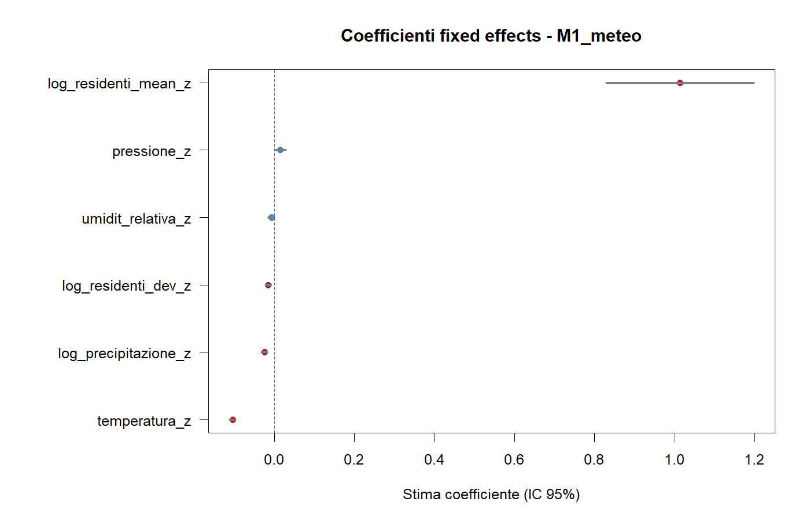
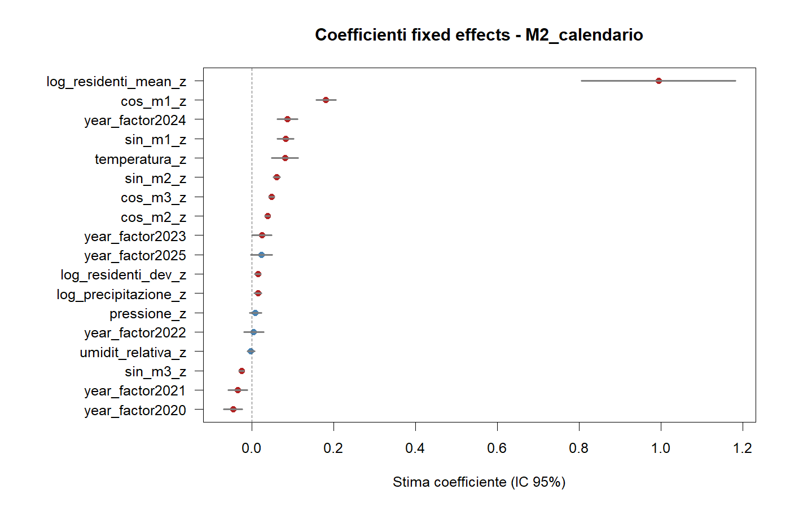
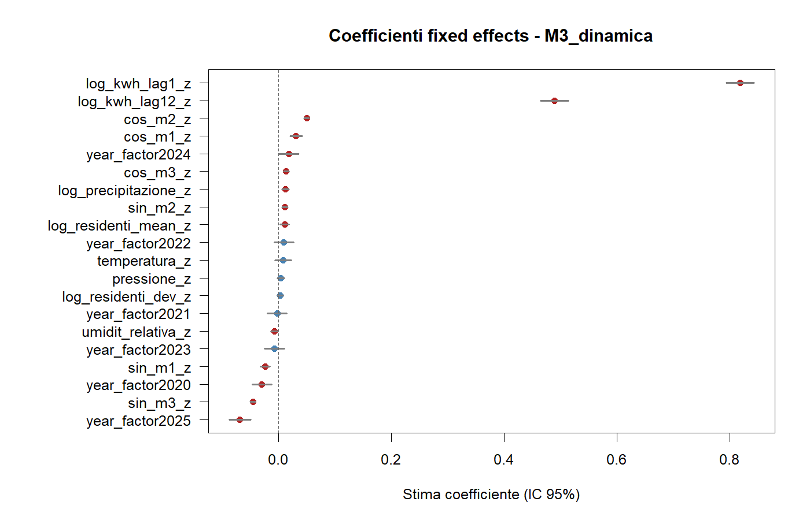
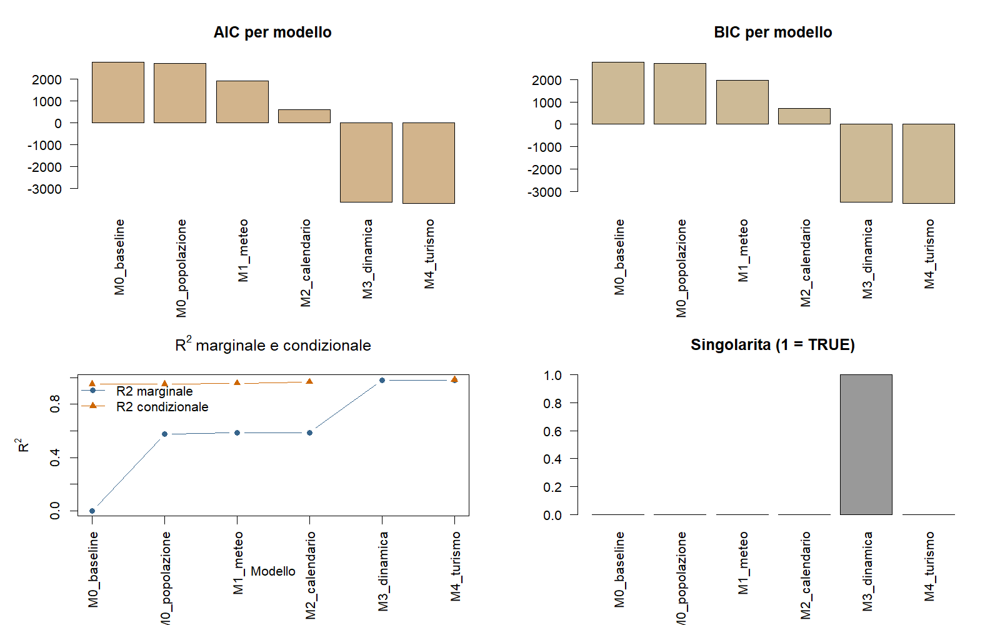

# Lettura statistica dei modelli con popolazione between/within

## Obiettivo

Questo report aggiorna l'analisi introducendo la popolazione comunale in forma piu' pulita, separando:

- la componente strutturale tra comuni;
- la componente di variazione interna al comune nel tempo.

Invece di usare una sola covariata `log(1 + residenti)`, il modello usa due termini:

$$
\text{log\_residenti\_mean}_{i} = \text{media nel tempo di } \log(1 + residenti_{it})
$$

$$
\text{log\_residenti\_dev}_{it} = \log(1 + residenti_{it}) - \text{log\_residenti\_mean}_{i}
$$

Questa decomposizione consente di distinguere tra:

- effetto `between`: i comuni strutturalmente piu' grandi consumano di piu'?
- effetto `within`: quando un comune cresce o si riduce nel tempo, cambia anche il consumo?

Questa e' la versione metodologicamente piu' corretta se vogliamo capire cosa il random intercept stesse davvero assorbendo.

## Sequenza dei modelli

- `M0_baseline`: solo intercetta + random intercept comunale.
- `M0_popolazione`: baseline + `log_residenti_mean_z` + `log_residenti_dev_z`.
- `M1_meteo`: popolazione + meteo.
- `M2_calendario`: popolazione + meteo + stagionalita'/anno.
- `M3_dinamica`: popolazione + meteo + calendario + dinamica.
- `M4_turismo`: popolazione + meteo + calendario + dinamica + arrivi turistici.

## Campione effettivo

| Metrica | Valore |
|---|---:|
| Osservazioni grezze nel CSV | 9546 |
| Osservazioni dopo filtro `year >= 2018` | 6882 |
| Osservazioni nel campione finale comune ai modelli | 5892 |
| Numero comuni nel campione finale | 73 |
| Valori `kwh` negativi nel dataset | 8 |
| Valori `kwh` negativi dal 2018 in poi | 7 |

L'uso della popolazione riduce ancora il campione comune rispetto alla versione senza controllo demografico, ma il trade-off e' ragionevole dato il guadagno interpretativo.

In questa versione del modello, i `kwh` negativi vengono trattati come `NA` prima di costruire `log_kwh` e i lag del consumo. Quindi non entrano piu' ne' nella trasformazione logaritmica ne' nella dinamica del modello come valori numericamente invalidi.

## Punto centrale

La nuova evidenza rafforza l'ipotesi iniziale: il random intercept del modello nullo stava assorbendo in larga parte una differenza di scala tra comuni.

Quando passiamo da `M0` a `M0_popolazione`:

- il confronto annidato e' fortemente significativo:

$$
\chi^2 = 71.218, \quad df = 2, \quad p = 3.43 \times 10^{-16}
$$

- il $R^2$ marginale sale da `0.000` a `0.576`;
- la deviazione standard del random intercept scende da `1.2939` a `0.8124`.

Questa e' la prova che una quota importante dell'eterogeneita' tra comuni e' spiegabile tramite popolazione osservata.

## Lettura econometrica della decomposizione

Il risultato piu' importante e' questo:

- `log_residenti_mean_z` e' forte e altamente significativo gia' in `M0_popolazione`;
- `log_residenti_dev_z` in `M0_popolazione` e' piccolo e non significativo.

Interpretazione:

- la dimensione media del comune conta molto;
- le piccole fluttuazioni temporali della popolazione dentro lo stesso comune contano molto meno.

Questo e' esattamente il pattern che ci si aspetta in un panel comunale di consumi energetici: la scala strutturale del comune spiega tanto, mentre le variazioni annuali della popolazione residente spiegano poco rispetto alla persistenza del consumo e alla stagionalita'.

## M0 - Baseline

### Risultati principali

| Quantita' | Valore |
|---|---:|
| AIC | 2759.1 |
| BIC | 2779.1 |
| logLik | -1376.55 |
| R2 marginale | 0.000 |
| R2 condizionale | 0.952 |
| Std. dev. random intercept | 1.2939 |

### Lettura

`M0` conferma che la variabilita' between-comuni domina il dataset. Senza covariate, il modello nullo spiega pochissimo tramite fixed effects ma moltissimo tramite differenze persistenti tra comuni.

## M0_popolazione - Popolazione between/within

### Coefficienti chiave

| Termine | Stima | Std. Error | p-value | Lettura |
|---|---:|---:|---:|---|
| `log_residenti_mean_z` | 1.0066 | 0.0951 | 2.12e-16 | I comuni strutturalmente piu' grandi consumano molto di piu'. |
| `log_residenti_dev_z` | -0.0078 | 0.0043 | 0.0719 | La variazione temporale interna del numero di residenti non e' chiaramente significativa. |

### Risultati principali

| Quantita' | Valore |
|---|---:|
| AIC | 2691.9 |
| BIC | 2725.3 |
| logLik | -1340.94 |
| R2 marginale | 0.576 |
| R2 condizionale | 0.952 |
| Std. dev. random intercept | 0.8124 |

### Lettura

Questo e' il passaggio metodologicamente piu' importante dell'intera revisione. La componente `mean` spiega gran parte della differenza strutturale tra comuni; la componente `dev` no. Quindi il random intercept stava davvero assorbendo soprattutto una scala comunale media, non tanto la dinamica demografica intra-comune.

## M1 - Meteo controllando per popolazione between/within

### Coefficienti di interesse

| Termine | Stima | p-value |
|---|---:|---:|
| `log_residenti_mean_z` | 1.0139 | 1.11e-16 |
| `log_residenti_dev_z` | -0.0153 | 0.00020 |
| `temperatura_z` | -0.1047 | 5.52e-128 |
| `log_precipitazione_z` | -0.0246 | 1.15e-09 |

### Risultati principali

| Quantita' | Valore |
|---|---:|
| AIC | 1906.1 |
| BIC | 1966.2 |
| R2 marginale | 0.586 |
| R2 condizionale | 0.957 |

### Lettura

La popolazione strutturale resta molto forte anche dopo il meteo. La componente `dev` diventa negativa e significativa, ma con coefficiente molto piccolo: puo' riflettere rumore di misura, composizione temporale imperfetta o correlazione con la dinamica non ancora esplicitata.

## M2 - Calendario e stagionalita'

### Coefficienti di interesse

| Termine | Stima | p-value |
|---|---:|---:|
| `log_residenti_mean_z` | 0.9938 | 5.73e-16 |
| `log_residenti_dev_z` | 0.0143 | 0.00048 |
| `temperatura_z` | 0.0809 | 1.12e-06 |
| `cos_m1_z` | 0.1806 | 1.21e-47 |
| `cos_m2_z` | 0.0379 | 2.41e-31 |

### Risultati principali

| Quantita' | Valore |
|---|---:|
| AIC | 585.8 |
| BIC | 726.1 |
| R2 marginale | 0.587 |
| R2 condizionale | 0.967 |

### Lettura

La stagionalita' migliora tantissimo il fit, ma non sostituisce il ruolo della popolazione strutturale. La componente `mean` resta quasi invariata in ampiezza. La componente `dev` diventa positiva e significativa, ma ancora piccola rispetto al peso della scala media del comune.

## M3 - Dinamica temporale

### Coefficienti di interesse

| Termine | Stima | p-value |
|---|---:|---:|
| `log_residenti_mean_z` | 0.0110 | 0.00541 |
| `log_residenti_dev_z` | 0.0027 | 0.2858 |
| `log_kwh_lag1_z` | 0.8183 | < 2e-16 |
| `log_kwh_lag12_z` | 0.4888 | 8.96e-300 |

### Risultati principali

| Quantita' | Valore |
|---|---:|
| AIC | -3629.8 |
| BIC | -3476.1 |
| R2 marginale | 0.982 |
| R2 condizionale | NA |
| Singolare | TRUE |

### Lettura

Appena entrano i lag, il ruolo della popolazione collassa quasi del tutto in termini di ampiezza. Questo e' coerente: i lag del consumo incorporano gia' molta dell'eterogeneita' strutturale di scala. La componente `dev` non e' piu' significativa, mentre la componente `mean` resta debolmente significativa ma molto piccola.

### Problema principale

- Il modello resta singolare.
- I lag dominano il modello.
- La popolazione media e i lag sono correlati, quindi la lettura causale della componente `mean` in `M3` va fatta con prudenza.

## M4 - Arrivi turistici

### Coefficienti di interesse

| Termine | Stima | p-value |
|---|---:|---:|
| `log_residenti_mean_z` | 0.0145 | 0.00434 |
| `log_residenti_dev_z` | 0.0037 | 0.1710 |
| `log_kwh_lag1_z` | 0.7982 | < 2e-16 |
| `log_kwh_lag12_z` | 0.4854 | 6.77e-292 |
| `log_totale_arrivi_z` | 0.0342 | 1.12e-17 |

### Risultati principali

| Quantita' | Valore |
|---|---:|
| AIC | -3701.3 |
| BIC | -3534.3 |
| R2 marginale | 0.9823 |
| R2 condizionale | 0.9824 |
| Std. dev. random intercept | 0.0147 |
| Singolare | FALSE |

### Lettura

Il modello finale conferma tre cose:

1. la popolazione media del comune ha ancora un effetto proprio, piccolo ma significativo;
2. la variazione interna della popolazione non aggiunge evidenza robusta;
3. gli `arrivi` aggiungono un contributo incrementale robusto anche dopo meteo, stagionalita' e dinamica.

La random intercept residua in `M4` e' quasi nulla. Questo significa che, una volta inseriti popolazione strutturale, meteo, stagionalita', dinamica e turismo, resta pochissima eterogeneita' comunale non spiegata.

## Confronto complessivo dei modelli

| Modello | AIC | BIC | R2 marginale | R2 condizionale | Singolare |
|---|---:|---:|---:|---:|---|
| M0_baseline | 2759.1 | 2779.1 | 0.0000 | 0.9515 | FALSE |
| M0_popolazione | 2691.9 | 2725.3 | 0.5762 | 0.9515 | FALSE |
| M1_meteo | 1906.1 | 1966.2 | 0.5857 | 0.9575 | FALSE |
| M2_calendario | 585.8 | 726.1 | 0.5871 | 0.9667 | FALSE |
| M3_dinamica | -3629.8 | -3476.1 | 0.9821 | NA | TRUE |
| M4_turismo | -3703.2 | -3542.8 | 0.9823 | 0.9824 | FALSE |

## Confronti annidati

| Confronto | Chisq | gdl | p-value | Lettura |
|---|---:|---:|---:|---|
| M0 -> M0_popolazione | 71.218 | 2 | 3.43e-16 | La decomposizione della popolazione migliora fortemente il modello nullo. |
| M0_popolazione -> M1 | 793.787 | 4 | 1.70e-170 | Il meteo aggiunge informazione oltre la popolazione. |
| M1 -> M2 | 1344.282 | 12 | 1.43e-280 | Stagionalita' e calendario migliorano molto il fit. |
| M2 -> M3 | 4219.604 | 2 | ~0 | La dinamica resta il blocco dominante. |
| M3 -> M4 | 75.380 | 1 | 3.88e-18 | Gli arrivi aggiungono contributo incrementale oltre i lag. |

## Identificazione del turismo

| Modello | AIC | BIC |
|---|---:|---:|
| m3 | -3629.787 | -3476.116 |
| m4_arrivi | -3703.167 | -3542.815 |
| m4_arrivi_destag | -3703.167 | -3542.815 |

Le due specifiche, `m4_arrivi` e `m4_arrivi_destag`, hanno fit identico. Questo e' atteso: quando residualizzi gli arrivi rispetto a struttura, meteo e calendario, stai isolando la parte degli arrivi non spiegata da scala comunale, clima e stagionalita'; il modello finale la usa con la stessa evidenza incrementale del segnale osservato, solo su una scala diversa.

In pratica:

- con `arrivi` osservati, il coefficiente e' `0.0342`;
- con `arrivi` residualizzati su struttura + meteo + calendario, il coefficiente e' `0.0260`;
- in entrambi i casi il `t value` e' `9.22` e il `p-value` e' `1.12e-17`.

Questo e' il test piu' utile per distinguere tra:

- effetto turismo reale;
- semplice co-movimento con estate, temperature elevate o maggiore uso di condizionatori.

Se il coefficiente restasse solo con gli arrivi osservati ma sparisse con gli arrivi residualizzati, avremmo un forte sospetto di confondimento stagionale/climatico. Qui non succede: il segnale turistico sopravvive anche dopo la destagionalizzazione e la depurazione dal meteo.

## Criticita' da tenere nel report finale

| Tema | Evidenza | Implicazione |
|---|---|---|
| `kwh` negativi | 8 casi totali, 7 dal 2018 | Ora vengono trattati come `NA` prima di log e lag; resta da valutarne il significato sostantivo nel dato grezzo. |
| Campione ridotto | 9546 -> 5892 osservazioni | L'inferenza finale e' su un sottoinsieme non banale del dataset. |
| Singolarita' in M3 | `singular = TRUE` | I lag collassano quasi completamente la varianza random. |
| Collinearita' lag | `lag1` e `lag12` molto correlati | Interpretazione dei coefficienti dinamici da fare con cautela. |
| Sovrapposizione turismo-dinamica | `arrivi` correla circa `0.538` con `lag1` e `0.534` con `lag12` | Parte del segnale turistico passa anche nella persistenza dei consumi. |
| Identificazione turismo | il coefficiente degli arrivi resta forte anche dopo residualizzazione su struttura + meteo + calendario | Il segnale non sembra ridursi a sola estate o uso di condizionatori. |
| Popolazione mean vs lag | la componente `mean` si riduce molto dopo i lag | Gran parte dell'effetto di scala viene assorbita dalla dinamica del consumo. |

## Conclusione operativa

Delle due modifiche richieste, il risultato importante e' questo:

- inserire la popolazione era corretto;
- separare popolazione `between` e `within` era ancora meglio.

La lettura finale piu' solida e':

- il random intercept del modello nullo stava assorbendo soprattutto differenze strutturali tra comuni;
- una parte rilevante di questa eterogeneita' e' spiegata dalla popolazione media del comune;
- la variazione temporale della popolazione dentro comune conta molto meno;
- una volta inserita la dinamica del consumo, il ruolo residuo della popolazione diventa piccolo;
- gli arrivi continuano ad aggiungere informazione anche dopo aver depurato il loro profilo stagionale e meteorologico.
