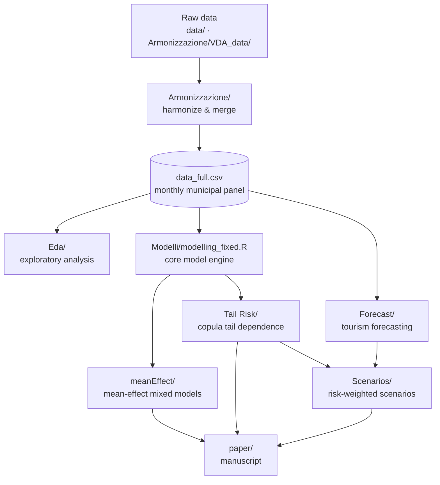

# Tourism Pressure and Municipal Electricity Demand in Valle d'Aosta

This repository contains the full data pipeline, statistical analysis, and manuscript for a study of
**how tourism pressure affects municipal electricity demand in the Valle d'Aosta region (Italy)**.
The analysis combines monthly tourism, electricity, meteorological, and demographic data for the
74 municipalities of the region (Jan 2015 – Sep 2025) and addresses three questions:

1. **Mean effect** — On average, how much does tourism raise municipal electricity consumption?
2. **Extreme dependence** — Do tourism and electricity demand spike *together* in the upper tail
   (joint stress), and where?
3. **Vulnerability / scenarios** — Which municipalities are most exposed under forward-looking
   high-tourism scenarios?

The final manuscript (targeted at *JRSS-A*) is in [paper/paper_vda_tourism_energy.tex](paper/paper_vda_tourism_energy.tex)
with the compiled PDF at [paper/paper_vda_tourism_energy.pdf](paper/paper_vda_tourism_energy.pdf).

> **Note on study design.** This is an observational regional study; reported relationships are
> associational, not causal. See the *Study Setting* and *Discussion* sections of the paper.

---

## Repository at a glance

| Folder | What it contains | Role |
|--------|------------------|------|
| [data/](data) | Raw / staged inputs: demographics ([data/Bilanci_demografici/](data/Bilanci_demografici)), meteorology ([data/meteo_raw/](data/meteo_raw), [data/meteo_clean_wide_all_stations.csv](data/meteo_clean_wide_all_stations.csv)), shapefiles ([data/vda_shapefile/](data/vda_shapefile)) | Inputs |
| [Armonizzazione/](Armonizzazione) | Harmonizes and merges all sources into the analysis panel `data_full.csv` | Data build |
| [Eda/](Eda) | Exploratory data analysis of tourism, meteorology, and combined signals | Exploration |
| [Interpolazione/](Interpolazione) | Spatial kriging of temperature (daily rolling-window + Shiny viewer). Auxiliary module — its surfaces are not consumed by the paper | Auxiliary |
| [Modelli/](Modelli) | **Main analysis hub** — mean-effect models, tail-risk copulas, scenarios, and forecasting | Analysis |
| [paper/](paper) | LaTeX manuscript, bibliography, and compiled PDF | Output |
| [archive/](archive) | Superseded / duplicate / scratch files moved out of the way (see [archive/README.md](archive/README.md)) | Archive |

Root-level scripts: [read_in.R](read_in.R) (meteo scraping/read-in, hard-coded local paths),
[Data_Cleaning_Combining.R](Data_Cleaning_Combining.R) (cleaning helpers), and
[Create_SF.R](Create_SF.R) (builds the spatial object from the regional shapefile).
[PianoD'azione.rmd](PianoD'azione.rmd) is the project's working action-plan notebook.

### Inside `Modelli/` (the analysis hub)

| Subfolder | Purpose | Key outputs |
|-----------|---------|-------------|
| [Modelli/meanEffect/](Modelli/meanEffect) | Nested linear mixed-effects models (M0–M4) of electricity on tourism, with shrinkage and maps | Figures + CSVs in [Modelli/meanEffect/report_assets/](Modelli/meanEffect/report_assets) |
| [Modelli/Tail Risk/](Modelli/Tail%20Risk) | Copula-based upper-tail dependence; ranks municipalities by joint tourism–electricity stress, with bootstrap CIs and empirical-Bayes shrinkage | Figures + CSVs in [report_assets/](Modelli/Tail%20Risk/report_assets) |
| [Modelli/Forecast/](Modelli/Forecast) | Tourism-arrival forecasting (NNAR) and spatial allocation; baseline vs. q95 shock loads | CSVs in [Modelli/Forecast/results/](Modelli/Forecast/results) |
| [Modelli/Scenarios/](Modelli/Scenarios) | Translates tail risk into forward high-tourism scenarios; risk-weighted impacts and validation | Figures in [report_assets/](Modelli/Scenarios/report_assets), CSVs in [results/](Modelli/Scenarios/results) |

The core model engine shared across these is [Modelli/modelling_fixed.R](Modelli/modelling_fixed.R).
(An alternate encoding-safe variant, `Modelli/modelling_fixed_nobom.R`, is kept for the
`run_copula_tail_risk_fixed.R` path; the canonical path uses `modelling_fixed.R`.)

---

## Data pipeline



`data_full.csv` is the central artifact (harmonized monthly panel). It is intentionally present in a
couple of locations so scripts can find it via relative-path fallbacks; do not delete those copies.

---

## How to reproduce

**Requirements:** R (≥ 4.2) with packages `lme4`, `copula`, `forecast`, `sf`, `dplyr`, plus a LaTeX
distribution with `latexmk`.

Run stages in order (each script discovers `data_full.csv` via relative-path fallbacks, so run from
the repo root or each script's own folder):

1. **Harmonize data** — scripts in [Armonizzazione/](Armonizzazione) produce `data_full.csv`.
2. **Mean effect** — [Modelli/meanEffect/modelling.R](Modelli/meanEffect/modelling.R), then
   [Modelli/meanEffect/generate_report_assets.R](Modelli/meanEffect/generate_report_assets.R).
3. **Tail risk** — [Modelli/Tail Risk/run_copula_tail_risk.R](Modelli/Tail%20Risk/run_copula_tail_risk.R),
   then [Modelli/Tail Risk/generate_tail_risk_report.R](Modelli/Tail%20Risk/generate_tail_risk_report.R)
   and [Modelli/Tail Risk/tailrisk_uncertainty.R](Modelli/Tail%20Risk/tailrisk_uncertainty.R)
   (bootstrap CIs, shrinkage, independence tests) and
   [Modelli/Tail Risk/validate_score_benchmarks.R](Modelli/Tail%20Risk/validate_score_benchmarks.R)
   (weight sensitivity + benchmark).
4. **Forecast** — scripts in [Modelli/Forecast/](Modelli/Forecast).
5. **Scenarios** — scripts in [Modelli/Scenarios/scripts/](Modelli/Scenarios/scripts), including
   [Modelli/Scenarios/scripts/scenario_impact_ci.R](Modelli/Scenarios/scripts/scenario_impact_ci.R)
   (scenario impact CIs).
6. **Build the paper** — from the [paper/](paper) folder:

   ```powershell
   latexmk -g -pdf -interaction=nonstopmode paper_vda_tourism_energy.tex
   ```

The manuscript figures are pulled directly from the `report_assets/` folders via relative paths, so
re-running steps 2–5 refreshes the figures the paper uses.

---

## How to access specific results

All result tables (CSV) and figures (PNG) live next to the script that produces them, under
`report_assets/` (figures + summary CSVs the paper uses) or `results/` (detailed CSVs).

### Final paper
- Manuscript source: [paper/paper_vda_tourism_energy.tex](paper/paper_vda_tourism_energy.tex)
- Compiled PDF: [paper/paper_vda_tourism_energy.pdf](paper/paper_vda_tourism_energy.pdf)
- References: [paper/references.bib](paper/references.bib)

### 1. Mean effect of tourism — [Modelli/meanEffect/report_assets/](Modelli/meanEffect/report_assets)
| Result | File |
|--------|------|
| Model comparison (M0–M4) metrics | [model_comparison_metrics.png](Modelli/meanEffect/report_assets/model_comparison_metrics.png) &middot; [mean_effect_model_compare.csv](Modelli/meanEffect/report_assets/mean_effect_model_compare.csv) |
| Key tourism coefficients | [mean_effect_key_coefficients.png](Modelli/meanEffect/report_assets/mean_effect_key_coefficients.png) &middot; [mean_effect_key_effects.csv](Modelli/meanEffect/report_assets/mean_effect_key_effects.csv) |
| Final model fixed effects | [mean_effect_fixed_effects.csv](Modelli/meanEffect/report_assets/mean_effect_fixed_effects.csv) |
| Per-municipality slopes / profile | [mean_effect_group_slopes.csv](Modelli/meanEffect/report_assets/mean_effect_group_slopes.csv) &middot; [municipality_profile.csv](Modelli/meanEffect/report_assets/municipality_profile.csv) |
| Municipality maps | [municipality_maps.png](Modelli/meanEffect/report_assets/municipality_maps.png) |
| Residual diagnostics | [final_model_residuals.png](Modelli/meanEffect/report_assets/final_model_residuals.png) |
| Nested ANOVA | [nested_anova.csv](Modelli/meanEffect/report_assets/nested_anova.csv) |

### 2. Tail-risk / extreme dependence — [Modelli/Tail Risk/report_assets/](Modelli/Tail%20Risk/report_assets)
| Result | File |
|--------|------|
| Copula selection & parameters | [copula_selection.csv](Modelli/Tail%20Risk/report_assets/copula_selection.csv) &middot; [copula_parameters.csv](Modelli/Tail%20Risk/report_assets/copula_parameters.csv) |
| Segment summary | [copula_segment_summary.csv](Modelli/Tail%20Risk/report_assets/copula_segment_summary.csv) |
| Upper-tail dependence (λ_U) with bootstrap CIs | [copula_tail_dependence_ci.csv](Modelli/Tail%20Risk/report_assets/copula_tail_dependence_ci.csv) |
| Independence tests (Kendall / Spearman / exchTest) | [copula_independence_tests.csv](Modelli/Tail%20Risk/report_assets/copula_independence_tests.csv) |
| Municipal tail-risk ranking (enriched) | [municipality_tail_risk_enriched.csv](Modelli/Tail%20Risk/report_assets/municipality_tail_risk_enriched.csv) |
| Tail-risk with empirical-Bayes shrinkage | [municipality_tail_risk_shrunk.csv](Modelli/Tail%20Risk/report_assets/municipality_tail_risk_shrunk.csv) |
| Risk-score CIs + rank probabilities | [municipality_tail_risk_ci.csv](Modelli/Tail%20Risk/report_assets/municipality_tail_risk_ci.csv) &middot; [municipality_rank_probabilities.csv](Modelli/Tail%20Risk/report_assets/municipality_rank_probabilities.csv) |
| Score weight sensitivity | [risk_score_weight_sensitivity.csv](Modelli/Tail%20Risk/report_assets/risk_score_weight_sensitivity.csv) |
| Benchmark vs. realized stress | [benchmark_comparison.csv](Modelli/Tail%20Risk/report_assets/benchmark_comparison.csv) |
| Maps & scatter | [tail_risk_map_score.png](Modelli/Tail%20Risk/report_assets/tail_risk_map_score.png) &middot; [tail_risk_map_conditional95.png](Modelli/Tail%20Risk/report_assets/tail_risk_map_conditional95.png) &middot; [tail_risk_vs_tourism_scatter.png](Modelli/Tail%20Risk/report_assets/tail_risk_vs_tourism_scatter.png) |

### 3. Forward scenarios — figures in [Modelli/Scenarios/report_assets/](Modelli/Scenarios/report_assets), tables in [Modelli/Scenarios/results/](Modelli/Scenarios/results)
| Result | File |
|--------|------|
| Shock Δ-kWh map | [scenario_shock_delta_kwh_map.png](Modelli/Scenarios/report_assets/scenario_shock_delta_kwh_map.png) |
| Tail-impact maps (kWh / weighted) | [scenario_tail_impact_kwh_map.png](Modelli/Scenarios/report_assets/scenario_tail_impact_kwh_map.png) &middot; [scenario_tail_impact_weighted_map.png](Modelli/Scenarios/report_assets/scenario_tail_impact_weighted_map.png) |
| Top-20 weighted exposure | [scenario_tail_top20_weighted.png](Modelli/Scenarios/report_assets/scenario_tail_top20_weighted.png) &middot; [scenario_tail_top20_weighted.csv](Modelli/Scenarios/results/scenario_tail_top20_weighted.csv) |
| Per-town impacts (annual / monthly) | [scenario_tail_impact_by_town_annual.csv](Modelli/Scenarios/results/scenario_tail_impact_by_town_annual.csv) &middot; [scenario_tail_impact_by_town_month.csv](Modelli/Scenarios/results/scenario_tail_impact_by_town_month.csv) |
| Scenario impact confidence intervals | [scenario_tail_impact_ci_by_town.csv](Modelli/Scenarios/results/scenario_tail_impact_ci_by_town.csv) &middot; [scenario_tail_impact_ci_regional.csv](Modelli/Scenarios/results/scenario_tail_impact_ci_regional.csv) |
| Validation (calibration / hit-rate / top-k) | [scenario_tail_validation_summary_metrics.csv](Modelli/Scenarios/results/scenario_tail_validation_summary_metrics.csv) &middot; [scenario_tail_validation_calibration.png](Modelli/Scenarios/report_assets/scenario_tail_validation_calibration.png) |

### 4. Tourism forecasts — [Modelli/Forecast/results/](Modelli/Forecast/results)
Baseline and q95-shock tourism-load forecasts (NNAR + spatial allocation) used as scenario inputs;
see the `scenario_forecast` and `intermediate` subfolders.

### Exploratory summaries — [Eda/](Eda)
Tourism monthly profiles and signatures ([eda_tourism_monthly_profile_by_municipality.csv](Eda/eda_tourism_monthly_profile_by_municipality.csv),
[eda_tourism_signature_by_municipality.csv](Eda/eda_tourism_signature_by_municipality.csv)) and
meteorological climatologies (`Eda/eda2_meteo_*.csv`).

---

## Archive

Old, duplicate, or scratch files were moved to [archive/](archive) so the working tree stays clear.
Nothing there is needed to reproduce the analysis or build the paper — see
[archive/README.md](archive/README.md) for the full inventory and original locations.
